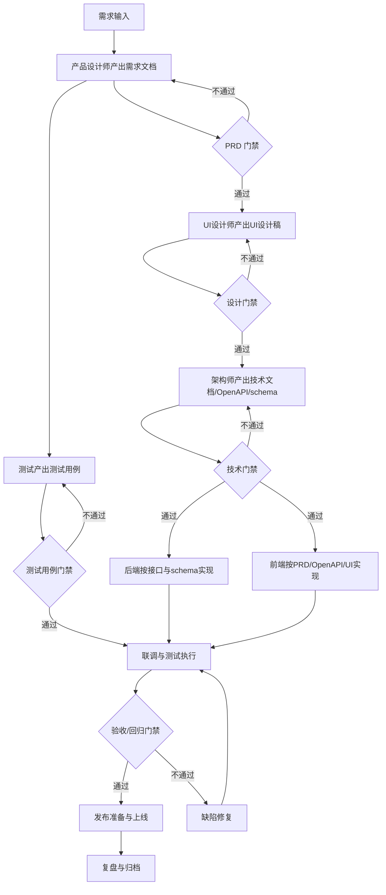

# 项目开发规范

## Purpose

本规范固定项目从需求到上线的中间产物、负责人、路径和门禁。后续项目默认按此流程推进；若业务需要变更流程，先由项目管理工程师评估影响，再交 CEO/CTO 确认。

项目管理判断依据：

- 关键路径：需求文档 -> UI 设计稿 -> 技术文档/OpenAPI/schema -> 开发 -> 测试用例/验证 -> 发布。
- 风险台账：阻塞、延期、范围变更必须有 owner、动作和截止时间。
- 范围控制：没有进入 PRD、UI、技术文档或测试用例的内容，不默认进入本轮开发承诺。
- 依赖管理：跨角色交付物必须有固定路径和交接评论。
- 透明度：每次状态变化、阻塞和交付路径必须在 issue 评论可见。

## End-to-End Flow



## Roles And Artifacts

| 阶段 | Owner | 必备产物 | 固定路径 | 交接对象 |
| --- | --- | --- | --- | --- |
| 需求设计 | 产品设计师 | PRD/需求文档 | `docs/01-product/{issue-key}-{slug}.md` 或 `docs/product/{issue-key}-{slug}.md` | UI设计师、架构师、测试 |
| UI 设计 | UI设计师 | UI设计稿、关键状态截图或 Figma 链接 | `docs/02-design/{issue-key}-{slug}.md` | 前端、测试 |
| 技术设计 | 架构师 | 技术方案、OpenAPI、数据库 schema | `docs/03-development/{issue-key}-{slug}.md`, `docs/03-development/openapi/{issue-key}.yaml`, `docs/03-development/schema/{issue-key}.sql` | 前端、后端、测试 |
| 后端开发 | 后端工程师 | 接口实现、迁移、单元/集成验证记录 | 代码仓库对应模块；验证记录写 issue 评论或 `docs/03-development/{issue-key}-backend-notes.md` | 前端、测试 |
| 前端开发 | 前端工程师 | UI/交互实现、接口对接、前端验证记录 | 代码仓库对应模块；验证记录写 issue 评论或 `docs/03-development/{issue-key}-frontend-notes.md` | 测试 |
| 测试设计 | APP测试工程师/Web测试工程师 | 测试用例、验收范围、回归范围 | `docs/04-testing/{issue-key}-test-cases.md` | 开发、项目管理 |
| 测试执行 | APP测试工程师/Web测试工程师 | 测试报告、缺陷清单、回归结论 | `docs/04-testing/{issue-key}-test-report.md` | 项目管理、CEO/CTO |
| 发布 | DevOps/CTO | 发布记录、回滚方案、监控和冒烟结果 | `docs/release/{date}-{issue-key}-{slug}.md` | CEO、项目管理 |
| 复盘 | 项目管理工程师 | 节点复盘、风险处理结论 | `docs/05-retrospective/{issue-key}-retro.md` | CEO、相关 owner |

## Required Gates

### PRD Gate

进入 UI、技术方案或测试设计前，PRD 必须满足：

- 背景、目标、用户/角色、主流程、异常流程、验收标准完整。
- 范围内、范围外明确。
- 依赖、风险、变更影响有 owner 和截止时间。
- 可用 `prd-qa-checker` 生成报告，输出到 `docs/review/prd-qa/{prd-file-stem}.prd-qa.generated.md`。

### UI Gate

进入前端实现或 UI 验收前，UI 设计必须满足：

- 覆盖 PRD 主流程、空态、错误态、加载态、权限态。
- 标明关键组件、布局约束、响应式/端差异。
- 有设计稿链接或截图索引，路径写入 issue 评论。

### Technical Gate

进入开发前，技术产物必须满足：

- 技术方案说明边界、数据流、失败处理、兼容/迁移策略。
- OpenAPI 明确路径、方法、参数、响应、错误码。
- 数据库 schema 明确表、字段、索引、迁移和回滚。
- 架构争议由 CTO/架构师裁决，项目管理工程师不替代裁决。

### Development Gate

开发执行必须满足：

- 后端只按技术文档、OpenAPI 和 schema 实现已确认接口。
- 前端按 PRD、OpenAPI、UI 设计稿开发，不自行扩展需求范围。
- 任一端发现文档缺口，必须评论标记 owner 和所需动作；缺口影响承诺时标 blocked。
- 接口变更必须先更新 OpenAPI/schema，再进入实现。

### QA Gate

测试设计和执行必须满足：

- 测试用例来自 PRD，业务逻辑按测试用例验证。
- 前端视觉和交互按 UI 设计稿验证。
- APP/移动端测试默认分派 APP测试工程师；Web/H5/后台页面默认分派 Web测试工程师。
- 原测试工程师仅补位、二线复核或沉淀质量流程，不作为默认主测试。

### Release Gate

发布前必须满足：

- 需求、设计、技术、测试产物路径已归档。
- 阻塞缺陷关闭或有 CEO/CTO 接受的风险豁免。
- 发布记录包含版本、环境、变更清单、回滚方案、监控、冒烟结果。
- 可用 `release-readiness-checker` 生成报告，输出到 `docs/review/release-readiness/{release-file-stem}.release-readiness.generated.md`。

## Issue Comment Contract

每次触碰任务都留评论，至少包含：

- 状态：`in_progress` / `in_review` / `blocked` / `done`。
- 改了什么：产物路径、代码路径或决策摘要。
- 下一步：owner、动作、截止时间。
- 依据：点名关键路径、风险台账、范围控制、依赖管理、透明度、变更影响评估、缓冲与节奏、升级时机或复盘中的相关项。

推荐格式：

```markdown
状态：in_progress
已完成：补齐 PRD，路径 `docs/01-product/WAR-123-wallet.md`。
下一步：@UI设计师 基于 PRD 出 UI 设计稿，截止 2026-07-12 18:00。
依据：关键路径/依赖管理。UI 设计稿是前端和测试的前置依赖。
风险：支付异常流程仍缺错误码 owner，@架构师 需在技术方案中补齐。
```

## Handoff To CTO

若规范落地需要修改其他 agent 指令或工程角色职责：

- 项目管理工程师只整理影响、目标 agent、建议改动和风险。
- 创建或评论交接给 CTO，由 CTO 安排对应 agent 修改。
- 不直接替代 CTO 修改技术裁决类职责，也不替代产品定义需求。

交接评论必须包含：

- 目标 agent 或角色。
- 需要修改的规则。
- 触发原因和影响范围。
- 建议截止时间。

## Risk Register Minimum

风险台账至少记录：

| 字段 | 说明 |
| --- | --- |
| 风险 | 具体可验证的问题 |
| 影响 | 影响范围、关键路径或发布日期 |
| Owner | 单一负责人 |
| 动作 | 下一步可执行动作 |
| 截止时间 | 具体日期和时间 |
| 状态 | open / watching / mitigated / accepted |

风险超出项目层可控范围时，项目管理工程师必须升级给 CEO。
