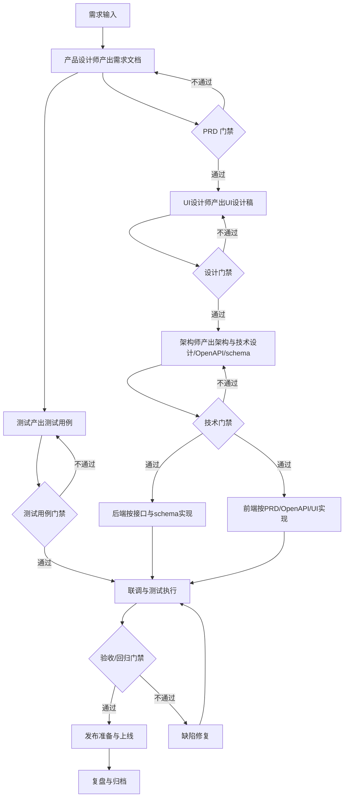

# 项目开发规范

## Purpose

本规范固定项目从需求到上线的中间产物、负责人、路径和门禁。后续项目默认按此流程推进；若业务需要变更流程，先由项目管理工程师评估影响，再交 CEO/CTO 确认。

文档组织原则默认按功能聚合，而不是按每个 issue 或每次小需求重复拆分。若新增需求只是既有功能的增强、优化、修复或范围补充，应直接更新该功能对应的既有文档，并追加更新记录，不再为同一功能平行创建第二份 PRD、UI、技术文档、测试文档或 schema 文档。

项目管理判断依据：

- 关键路径：需求文档 -> UI 设计稿 -> 架构与技术设计 -> OpenAPI/schema -> 开发 -> 测试用例/验证 -> 发布。
- 风险台账：阻塞、延期、范围变更必须有 owner、动作和截止时间。
- 范围控制：没有进入 PRD、UI、架构与技术设计文档或测试用例的内容，不默认进入本轮开发承诺。
- 依赖管理：跨角色交付物必须有固定路径和交接评论。
- 文档归档：路径、命名、中文内容和仓库归档要求由 `$project-structure-governance` 统一定义和检查；本规范只消费其 canonical path，不重复维护完整路径清单。
- 透明度：每次状态变化、阻塞和交付路径必须在 issue 评论可见。
- 初始化要求：新需求创建后先检查既有功能文档是否存在；若存在则沿用原文档并补更新记录，若不存在再按固定目录和模板初始化文档骨架。
- 推荐优先使用 `feature-doc-bootstrap` 自动初始化目录、模板和设计资产骨架，减少手工建档偏差。
- 推荐在关键门禁前使用 `artifact-consistency-checker` 检查跨文档引用和功能产物闭环。

## End-to-End Flow

Lifecycle gates use six machine-readable stages: `intake`, `design`, `development`, `qa`, `release`, and `closure`. Always pass the current stage to consolidated governance commands so future-stage artifacts do not block current work.



## Roles And Artifacts

| 阶段 | Owner | 必备产物 | 固定路径 | 交接对象 |
| --- | --- | --- | --- | --- |
| 需求设计 | 产品设计师 | PRD/需求文档 | `docs/product/{feature-slug}.md` | UI设计师、架构师、测试 |
| UI 设计 | UI设计师 | UI 设计交接文档、本地设计源文件、页面截图、导出资源 | `docs/design/{feature-slug}.md`, `docs/design/{feature-slug}.fig`, `docs/design/{feature-slug}/` | 前端、测试 |
| 架构与技术设计 | 架构师 | 架构与技术设计文档、OpenAPI、数据库 schema | `docs/development/{feature-slug}.md`, `docs/development/openapi/openapi.yaml`, `docs/development/schema/{feature-slug}.sql` | 前端、后端、测试 |
| 后端开发 | 后端工程师 | 接口实现、迁移、单元/集成验证记录 | 代码仓库对应模块；验证记录写 issue 评论或 `docs/development/{feature-slug}-backend-notes.md` | 前端、测试 |
| 前端开发 | 前端工程师 | UI/交互实现、接口对接、前端验证记录 | 代码仓库对应模块；验证记录写 issue 评论或 `docs/development/{feature-slug}-frontend-notes.md` | 测试 |
| 测试设计 | APP测试工程师/Web测试工程师 | 测试用例、验收范围、回归范围 | `docs/testing/{feature-slug}-test-cases.md` | 开发、项目管理 |
| 测试执行 | APP测试工程师/Web测试工程师 | 测试报告、缺陷清单、回归结论 | `docs/testing/{feature-slug}-test-report.md` | 项目管理、CEO/CTO |
| 发布 | DevOps/CTO | 发布记录、回滚方案、监控和冒烟结果 | `docs/release/{date}-{issue-key}-{slug}.md` | CEO、项目管理 |
| 复盘 | 项目管理工程师 | 节点复盘、风险处理结论 | `docs/retrospective/{feature-slug}-retro.md` | CEO、相关 owner |

文档命名规则：

- `feature-slug` 必须是稳定的功能标识，不跟随单次 issue 编号变化。
- 若同一功能发生二次、三次迭代，继续更新同一个 `feature-slug` 文件。
- 每次更新必须在原文档追加一条更新记录，至少包含日期、issue、变更摘要和作者。
- 只有发布记录属于按发布事件单独存档的运行文档，不替代功能文档本身。

UI 设计资产命名规则：

- 设计源文件：`docs/design/{feature-slug}.fig`
- 页面截图目录：`docs/design/{feature-slug}/screens/`
- 导出资源目录：`docs/design/{feature-slug}/exports/`
- 图标与位图资源目录：`docs/design/{feature-slug}/assets/`
- 页面截图文件命名：`page-{page-name}-{state}.png`
- 多端截图文件命名：`page-{page-name}-{state}-{platform}.png`
- 导出图标文件命名：`asset-{name}.{ext}`
- 标注图或说明图命名：`annot-{page-name}-{topic}.png`

PRD 推荐直接使用模板：

- [PRD Template](../templates/prd-template.md)

## Required Gates

### PRD Gate

进入 UI、架构与技术设计或测试设计前，PRD 必须满足：

- 背景、目标、用户/角色、主流程、异常流程、验收标准完整。
- 范围内、范围外明确。
- 依赖、风险、变更影响有 owner 和截止时间。
- 可用 `prd-qa-checker` 生成报告，输出到 `docs/review/prd-qa/{prd-file-stem}.prd-qa.generated.md`。

### UI Gate

进入前端实现或 UI 验收前，UI 设计必须满足：

- 覆盖 PRD 主流程、空态、错误态、加载态、权限态。
- 标明关键组件、布局约束、响应式/端差异。
- 本地设计源文件必须落盘，例如 `docs/design/{feature-slug}.fig`；若使用其他设计源格式，也必须以本地文件形式保存。
- 页面截图必须按功能目录保存到 `docs/design/{feature-slug}/`，必要时可细分 `screens/`、`assets/`、`exports/` 子目录。
- UI 交接文档 `docs/design/{feature-slug}.md` 中必须包含截图索引，明确页面名称、状态和对应截图文件。
- 在线 Figma 链接可以作为补充，但不能替代本地设计源文件和本地截图资产。
- 页面截图、导出资源和标注图必须遵循统一命名规则，避免同一功能目录下文件命名随意变化。
- 可用 `ui-design-checker` 生成报告，输出到 `docs/review/ui-design/{ui-file-stem}.ui-design.generated.md`。

UI 设计推荐直接使用模板：

- [UI Design Template](../templates/ui-design-template.md)

### Technical Gate

进入开发前，技术产物必须满足：

- 架构与技术设计文档说明系统边界、模块拆分、调用链路、数据流、失败处理、兼容/迁移策略。
- 架构与技术设计文档明确技术选型，包括使用的语言、框架、数据库、中间件，以及是否复用现有服务。
- 架构与技术设计文档明确实现归属，包括技术 owner、前端 owner、后端 owner、测试 owner、发布 owner。
- 架构与技术设计文档明确实现策略，包括接口由哪个服务提供、数据落库位置、事务/幂等/权限/异常处理方案。
- OpenAPI 明确路径、方法、参数、响应、错误码，并以 `docs/development/openapi/openapi.yaml` 作为唯一主文档。
- 数据库 schema 明确表、字段、索引、迁移和回滚。
- 可用 `architecture-design-checker` 生成报告，输出到 `docs/review/architecture-design/{design-file-stem}.architecture-design.generated.md`。
- 架构争议由 CTO/架构师裁决，项目管理工程师不替代裁决。

### Development Gate

开发执行必须满足：

- 后端只按架构与技术设计文档、OpenAPI 和 schema 实现已确认接口，不自行改变服务边界或技术选型。
- 前端按 PRD、OpenAPI、UI 设计稿开发，不自行扩展需求范围。
- 前端按架构与技术设计文档约定的交互边界和依赖方式对接，不自行重定义接口语义或状态流转。
- 任一端发现文档缺口，必须评论标记 owner 和所需动作；缺口影响承诺时标 blocked。
- 接口变更必须先更新 `docs/development/openapi/openapi.yaml` 和相关 schema，再进入实现。

## Architecture And Technical Design Document Minimum

每个功能在首次进入开发前，必须先补齐 `docs/development/{feature-slug}.md`；后续针对该功能的增强需求继续在原文档上迭代，至少包含：

- 基本信息：需求名称、issue key、作者、日期、关联 PRD/UI/OpenAPI/schema 路径。
- 背景与目标：问题背景、本次目标、明确不做的范围。
- 系统边界：涉及服务、模块、上下游依赖、同步或异步调用关系。
- 技术选型：语言、框架、数据库、中间件、是否复用现有能力。
- 实现策略：核心流程、异常流程、状态流转、事务、幂等、权限、失败兜底。
- 接口与数据摘要：本次涉及的 OpenAPI 变更摘要和 schema 变更摘要，并链接到正式文件。
- 角色分工：技术 owner、前端、后端、测试、发布负责人。
- 风险与发布：技术风险、兼容风险、迁移方案、回滚方案、监控点。

推荐直接使用模板：

- [Architecture Design Template](../templates/architecture-design-template.md)

推荐在立项时先跑初始化清单：

- [New Demand Init Checklist](new-demand-init-checklist.md)

### QA Gate

测试设计和执行必须满足：

- 测试用例来自 PRD，业务逻辑按测试用例验证。
- 前端视觉和交互按 UI 设计稿验证。
- APP/移动端测试默认分派 APP测试工程师；Web/H5/后台页面默认分派 Web测试工程师。
- 原测试工程师仅补位、二线复核或沉淀质量流程，不作为默认主测试。
- 可用 `test-case-checker` 生成报告，输出到 `docs/review/test-case/{testcase-file-stem}.test-case.generated.md`。

测试用例推荐直接使用模板：

- [Test Case Template](../templates/test-case-template.md)

### Release Gate

发布前必须满足：

- 需求、设计、技术、测试产物路径已归档。
- 阻塞缺陷关闭或有 CEO/CTO 接受的风险豁免。
- 发布记录包含版本、环境、变更清单、回滚方案、监控、冒烟结果。
- 可用 `release-readiness-checker` 生成报告，输出到 `docs/review/release-readiness/{release-file-stem}.release-readiness.generated.md`。

### Retrospective Gate

进入关闭或归档前，复盘产物必须满足：

- 复盘文档已归档到 `docs/retrospective/{feature-slug}-retro.md`。
- 已记录目标与结果回顾、关键时间线、问题与根因、改进动作。
- 若复盘结论影响 PRD、UI、技术文档、测试资产或流程规范，必须在对应主文档追加更新记录。

复盘推荐直接使用模板：

- [Retrospective Template](../templates/retrospective-template.md)

## Issue Comment Contract

每次触碰任务都留评论，至少包含：

- 状态：`in_progress` / `in_review` / `blocked` / `done`。
- 改了什么：产物路径、代码路径或决策摘要。
- 下一步：owner、动作、截止时间。
- 依据：点名关键路径、风险台账、范围控制、依赖管理、透明度、变更影响评估、缓冲与节奏、升级时机或复盘中的相关项。

推荐格式：

```markdown
状态：in_progress
已完成：补齐 PRD，路径 `docs/product/wallet.md`。
下一步：@UI设计师 基于 PRD 出 UI 设计稿，截止 2026-07-12 18:00。
依据：关键路径/依赖管理。UI 设计稿是前端和测试的前置依赖。
风险：支付异常流程仍缺错误码 owner，@架构师 需在技术方案中补齐。
```

## Handoff To CTO

若规范落地需要修改其他 agent 指令或工程角色职责：

- 项目管理工程师只整理影响、目标 agent、建议改动和风险。
- 创建或评论交接给 CTO，由 CTO 安排对应 agent 修改。
- 不直接替代 CTO 修改技术裁决类职责，也不替代产品定义需求。

交接评论必须包含：

- 目标 agent 或角色。
- 需要修改的规则。
- 触发原因和影响范围。
- 建议截止时间。

## Risk Register Minimum

风险台账至少记录：

| 字段 | 说明 |
| --- | --- |
| 风险 | 具体可验证的问题 |
| 影响 | 影响范围、关键路径或发布日期 |
| Owner | 单一负责人 |
| 动作 | 下一步可执行动作 |
| 截止时间 | 具体日期和时间 |
| 状态 | open / watching / mitigated / accepted |

风险超出项目层可控范围时，项目管理工程师必须升级给 CEO。
